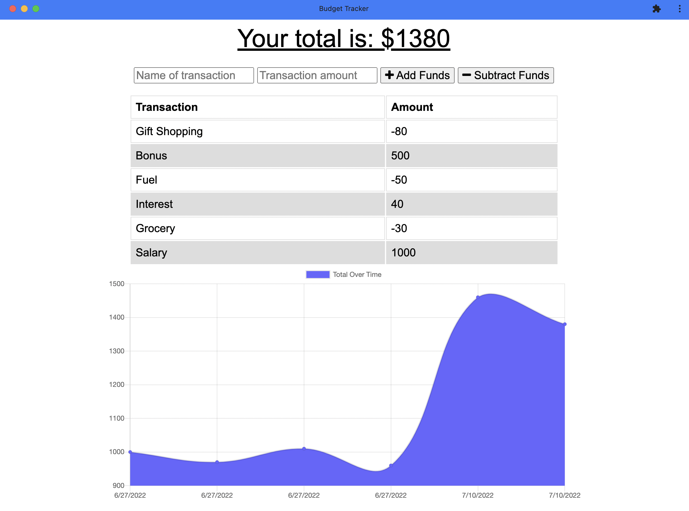

# Budget Tracker Starter Code
## Purpose
This is a refactor project for an existing budget tracker app.

The refactor work was done to add PWA capablities to the app and included the following:
* Users will now be able to add expenses and deposits without a network connection.
* All changes made when app is offline is send to server when connection is restored.
* The app also have service workers to ensure that the pages load if opened atleast once , when network connection is weak.
* Users can also install the app on the their devices.

## Built With
* Html
* CSS
* IndexedDB
* MangoDB
* Service Worker

## Usage
* Clone the application from github.
* Run npm install.
* Run npm start.
    The app will be available on : http://localhost:8080
* The app can also be installed on mobile devices.

## Website
Github Repo: https://github.com/meghark/budget-pwa-webapp-serviceworker
Deployed App: 

## Website screenshot

## Contribution
Created by Megha Kulathattil.

## Questions
if you have any questions about the repository, open an issue/pr or contact me directly at megha.nambiar@gmail.com You can find more of my work at Github.
